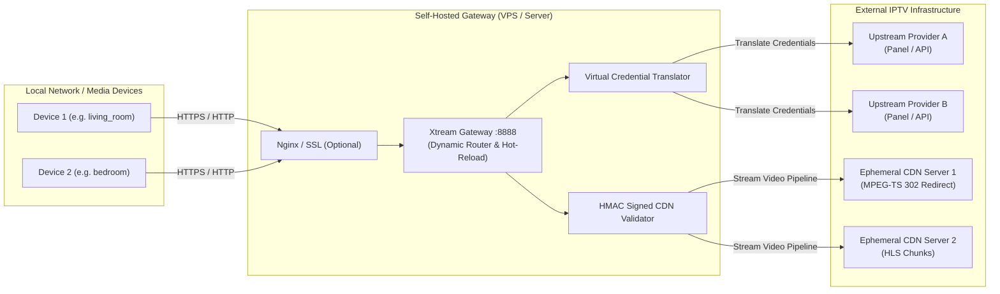

# Xtream Gateway

[](LICENSE)
[](docker-compose.yml)
[](Dockerfile)
[](https://github.com/)

A lightweight, production-ready reverse proxy and dynamic multi-provider router designed for the **Xtream Codes API** and **HLS / MPEG-TS streaming**.

Built for self-hosters and homelab enthusiasts who need to bypass domestic ISP SNI/IP blocks, proxy ephemeral CDN redirects, and decouple client playback credentials from volatile upstream IPTV subscriptions.

---

## Architecture Overview



---

## Key Features

* **Virtual Client Profiles (Decoupled Credentials):** Configure client devices with static, custom credentials once. When an upstream provider expires, changes servers, or issues new credentials, update only `providers.json` on the server. Clients continue operating without reconfiguration.
* **Dynamic Multi-Provider Routing:** Route multiple independent IPTV subscriptions through a single entry point. The gateway inspects incoming requests and maps traffic to the correct upstream provider automatically.
* **Transparent 302 CDN Redirect Following:** Many modern IPTV networks issue `HTTP 302 Found` redirects pointing to ephemeral, dynamically allocated CDN edge IPs. The gateway resolves and pipes continuous MPEG-TS and MP4 streams transparently without breaking client parsers.
* **HLS Playlist Segment Rewriting:** Relative and dynamic segment URLs in `.m3u8` playlists are rewritten on the fly to route through the gateway with cryptographic HMAC signatures.
* **HMAC Signed URL Security (Anti-Open Proxy):** All proxied segment and CDN paths are cryptographically signed (`/cdn/<token>/<host>/<path>`). Unauthorized third parties cannot abuse your server as an open HTTP proxy.
* **Anti-SSRF Shield:** Blocks requests targeting internal or private network ranges (`127.0.0.1`, `10.0.0.0/8`, `192.168.0.0/16`, `172.16.0.0/12`), preventing internal network enumeration.
* **Built-in Rate Limiter / Scanner Shield:** Protects against aggressive port scanners and brute-force attacks by automatically jailing abusive source IPs in memory.
* **Hot-Reloading Configuration:** Automatically reloads `providers.json` whenever modified. Zero downtime, no container restarts required.
* **Dual HTTP/HTTPS & HTTP/2 Support:** Dynamically inspects `X-Forwarded-Proto` and adapts Xtream API responses (`server_info.server_protocol` and ports) for seamless integration behind reverse proxies (Nginx, Traefik, Caddy).
* **Minimal Footprint:** Native Node.js stream pipelines. Consumes ~30 MB of RAM and minimal CPU under load.

---

## Quick Start (Docker Compose)

### 1. Clone the repository
```bash
git clone https://github.com/Canx/xtream-gateway.git
cd xtream-gateway
```

### 2. Prepare configuration
```bash
cp .env.example .env
cp providers.example.json providers.json
```

Edit `.env` to define your secret salt:
```bash
CDN_SECRET="generate_a_random_secure_string_here"
```

### 3. Define your providers in `providers.json`
Configure your device profiles and map them to your upstream subscriptions:

```json
[
  {
    "id": "living-room",
    "name": "Living Room Profile",
    "clientUser": "living_room",
    "clientPass": "secure_pass_1",
    "upstream": {
      "url": "http://provider1.example.com",
      "user": "upstream_account_user",
      "pass": "upstream_account_pass"
    }
  },
  {
    "id": "bedroom",
    "name": "Bedroom Profile",
    "clientUser": "bedroom",
    "clientPass": "secure_pass_2",
    "upstream": {
      "url": "http://provider2.example.com:8080",
      "user": "upstream_account_user2",
      "pass": "upstream_account_pass2"
    }
  }
]
```

### 4. Start the service
```bash
docker compose up -d
```

Check logs:
```bash
docker compose logs -f
```

---

## Configuration Reference

### Environment Variables (`.env`)

| Variable | Default | Description |
| :--- | :---: | :--- |
| `PORT` | `8888` | Port on which the container listens internally. |
| `PROXY_HOST` | *(empty)* | Optional public hostname or IP. If omitted, the gateway uses the incoming `Host` header. |
| `CDN_SECRET` | *(salt)* | Cryptographic salt used to sign `/cdn/` URLs via HMAC-SHA256. |
| `PROVIDERS_FILE` | `/app/providers.json` | Path to the provider mapping configuration file. |

### `providers.json` Schema

Each entry represents a routing profile:

| Field | Type | Description |
| :--- | :---: | :--- |
| `id` | String | Unique profile identifier. |
| `name` | String | Descriptive name for logging. |
| `clientUser` | String | Custom username accepted from clients. |
| `clientPass` | String | Custom password accepted from clients. |
| `upstream.url` | String | Base URL of the upstream Xtream Codes server (including port if non-standard). |
| `upstream.user` | String | Real subscription username required by upstream. |
| `upstream.pass` | String | Real subscription password required by upstream. |

> **Note:** Direct pass-through mode is also supported. If you omit `clientUser` and `clientPass`, the gateway matches requests directly against `upstream.user` and `upstream.pass`.

---

## Production Deployment (Nginx Reverse Proxy & TLS)

For encrypted end-to-end streaming over TLS 1.3 / HTTP/2 with a valid Let's Encrypt certificate, place the gateway behind Nginx:

```nginx
server {
    listen 80;
    server_name stream.yourdomain.com;
    return 301 https://$host$request_uri;
}

server {
    listen 443 ssl http2;
    server_name stream.yourdomain.com;

    ssl_certificate /etc/letsencrypt/live/stream.yourdomain.com/fullchain.pem;
    ssl_certificate_key /etc/letsencrypt/live/stream.yourdomain.com/privkey.pem;

    location / {
        proxy_pass http://127.0.0.1:8888;
        proxy_http_version 1.1;
        proxy_set_header Upgrade $http_upgrade;
        proxy_set_header Connection 'upgrade';
        proxy_set_header Host $host;
        proxy_set_header X-Real-IP $remote_addr;
        proxy_set_header X-Forwarded-For $proxy_add_x_forwarded_for;
        proxy_set_header X-Forwarded-Proto $scheme;

        # Critical streaming parameters
        proxy_buffering off;
        proxy_read_timeout 86400s;
        proxy_send_timeout 86400s;
    }
}
```

---

## Security Highlights

1. **RFC 7230 Compliant Headers:** Strips conflicting `Transfer-Encoding: chunked` headers when explicit `Content-Length` is calculated, preventing protocol errors on strict HTTP clients (LibVLC, OkHttp, Chromium).
2. **CORS Preflight:** Native handling of `OPTIONS` requests with full CORS headers for Electron and web-based players.
3. **SSRF Mitigation:** Automatically denies requests directed at loopback addresses and private subnets (`127.0.0.0/8`, `10.0.0.0/8`, `192.168.0.0/16`, `172.16.0.0/12`).
4. **User-Agent Sanitization:** Normalizes client User-Agent strings before forwarding upstream, bypassing upstream WAF blocks targeting generic HTTP libraries.

---

## Legal Disclaimer

This software is an open-source HTTP proxy and network routing utility developed strictly for educational and personal network management purposes. 

* The developers do not host, store, stream, or distribute any copyrighted media or audiovisual content.
* The software does not include playlists, channels, or credentials.
* Users are solely responsible for ensuring that their use of this software complies with all applicable local, national, and international laws, regulations, and third-party terms of service.

---

## License

Released under the [MIT License](LICENSE).
